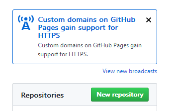
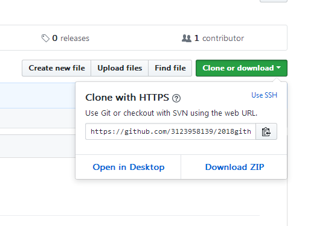
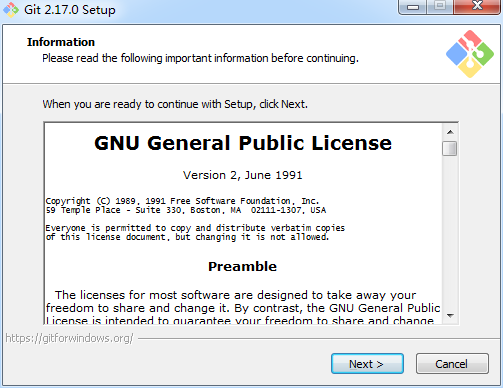
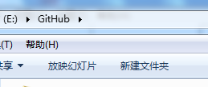
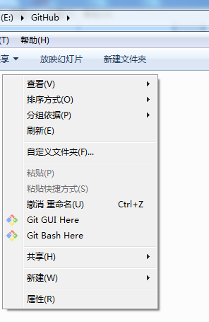
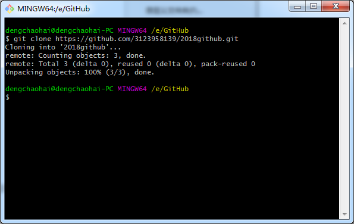
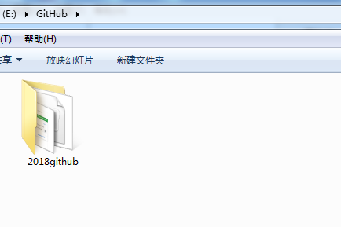
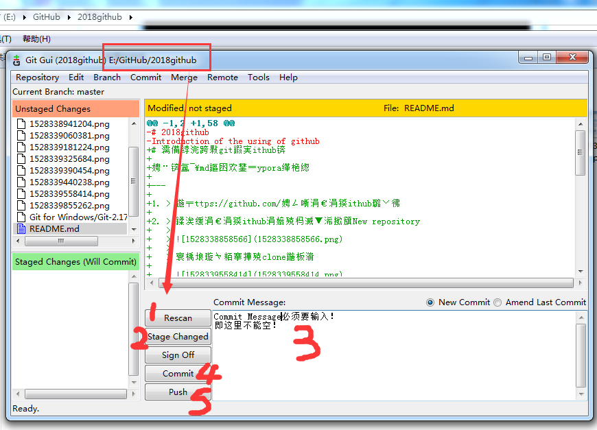

# 如何使用git和github？

注：该md文件用Typora编辑

---

1. > 在https://github.com/ 注册一个github账号

2. > 创建一个github上的远程仓库New repository
   >
   > 
   >
   > 得到该仓库的clone地址
   >
   > 
   >
   > 
   >
   > 

3. > 本地电脑安装for windows版本的git
   >
   > 
   >
   > 

4. > 本地电脑E盘创建一个文件夹GitHub当作本地仓库
   >
   > 
   >
   > 
   >
   > 

5. > 在该GitHub文件夹下右键Git Bash Here
   >
   > 
   >
   > 

6. > 克隆github上的远程仓库到本地git clone https://github.com/3123958139/2018github.git 
   >
   > 
   >
   > 得到
   >
   > 
   >
   > 

7. > 退出Git Bash并进入本地仓库2018github文件夹，右键Git Gui Here，然后
   >
   > Step1：Rescan查看本地仓库文件是否有更新
   >
   > Step2：如果有则Stage Changed
   >
   > Step3、4：在Commit Message里面输入信息，进行Commit
   >
   > Step5：最后是Push文件到远程仓库
   >
   > 
   >
   > **不管是添加、更新、删除文件，使用Git Gui都是走上面那5步，很方便**

---

**==总结：用git bash进行clone，用git gui进行push==**

